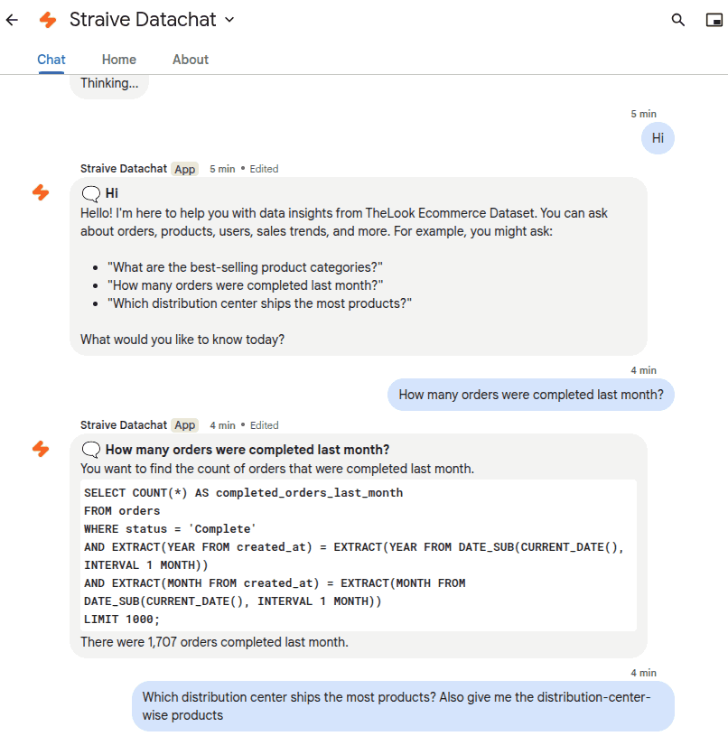

# Google Datachat

A Google Chat integration that answers data questions by executing BigQuery SQL queries against "TheLook Ecommerce" dataset.

[](LICENSE)



## Overview

Google Datachat is a chatbot for Google Chat that:

- Interprets natural language questions about e-commerce data
- Automatically generates SQL queries using OpenAI LLMs
- Executes queries against the BigQuery public "TheLook Ecommerce" dataset
- Returns concise answers based on the query results

The bot provides a seamless conversational interface to data analytics, eliminating the need for users to write SQL queries manually.

## Features

- **Natural Language to SQL**: Converts questions into optimized BigQuery SQL queries
- **Real-time Query Execution**: Runs queries against BigQuery directly from chat
- **Interactive Responses**: Shows thinking stages (analyzing, querying, interpreting)
- **Easy Integration**: Simple setup within Google Workspace environments
- **Secure Authentication**: Uses Google Service Account authentication

## Architecture

- **Frontend**: Google Chat interface
- **Backend**: Cloudflare Worker serverless platform
- **AI Processing**: OpenAI GPT-4.1 models (mini for query generation, nano for result interpretation)
- **Data Source**: BigQuery public dataset "thelook_ecommerce"
- **Authentication**: Google Service Account with JWT token generation

## Prerequisites

- Google Workspace Account (required for Chat API)
- Google Cloud Platform project with Chat API enabled
- Cloudflare account for Worker deployment
- OpenAI API key

## Setup

Use a Google Workspace Account. Chat API is available only in Google Workspace accounts.

<!--

This application is deployed by $ADMIN at
https://console.cloud.google.com/home/dashboard?authuser=2&project=straive-datachat
-->

1. [Enable the Chat API](https://console.cloud.google.com/flows/enableapi?apiid=chat.googleapis.com)
2. Configure OAuth:
   - Go to [OAuth configuration](https://console.cloud.google.com/auth/overview/create)
   - Set [Audience](https://console.cloud.google.com/auth/audience) to "Internal"
3. Create a service account:
   - Navigate to [Service Accounts](https://console.cloud.google.com/iam-admin/serviceaccounts/create)
   - Create a service account without roles
   - Generate and download a JSON key
   <!-- I used this configuration:
   - Name: Offline
   - Email: offline@straive-datachat.iam.gserviceaccount.com
   - No roles or users
   - Link: https://console.cloud.google.com/iam-admin/serviceaccounts/details/103936132819337995173?inv=1&invt=AbxtxA&project=comms-apps
     -->
4. Save the JSON key in `.dev.vars` as a single line, e.g.:
   ```ini
   GOOGLE_SERVICE_ACCOUNT='{ "type": "service_account", "project_id": "...", ... }'
   ```
5. Grant BigQuery permissions to the service account:
   ```bash
   gcloud projects add-iam-policy-binding YOUR_PROJECT_ID \
     --member="serviceAccount:YOUR_SERVICE_ACCOUNT_EMAIL" \
     --role="roles/bigquery.jobUser"
   gcloud projects add-iam-policy-binding YOUR_PROJECT_ID \
     --member="serviceAccount:YOUR_SERVICE_ACCOUNT_EMAIL" \
     --role="roles/bigquery.user"
   ```
6. Configure the Chat API in [Google Cloud Console](https://console.cloud.google.com/apis/api/chat.googleapis.com/hangouts-chat):
   - App Name: Google Datachat (or your preferred name)
   - Avatar URL: Choose an appropriate image URL
   - Description: A chatbot that answers questions from TheLook Ecommerce data
   - Interactive features: Enable all
   - Connection Settings: HTTP endpoint URL
   - HTTP endpoint URL: Your Cloudflare Worker URL + "/googlechat" (e.g., `https://google-datachat.example.workers.dev/googlechat`)
   - Authentication audience: HTTP endpoint URL
   - Visibility: Choose appropriate visibility setting for your organization
   <!-- I used this configuration:
   - App Name: Straive Datachat
   - Avatar URL: `https://encrypted-tbn0.gstatic.com/images?q=tbn:ANd9GcSCPpb1Hpdia-kMDmeGQOCgxplz2m_EUPbWsw&s`
   - Description: Check your Service Desk ticket status
   - Interactive features: Enable everything
   - Connection Settings: HTTP endpoint URL
   - HTTP endpoint URL: `https://google-datachat.sanand.workers.dev/googlechat`
   - App home URL: `https://google-datachat.sanand.workers.dev/`
   - Authentication audience: HTTP endpoint URL
   - Visibility: Make chat available to specific people and groups in Straive.com (add users, comma-separated)
   - Logs: Log errors to Logging
     -->

Deploy to Cloudflare Workers:

1. Clone this repository:

   ```bash
   git clone https://github.com/yourusername/google-datachat.git
   cd google-datachat
   ```

2. Install dependencies:

   ```bash
   npm install
   ```

3. Add required secrets:

   ```bash
   # Add the service account JSON (as a single line)
   npx wrangler secret put GOOGLE_SERVICE_ACCOUNT

   # Add your OpenAI API key
   npx wrangler secret put OPENAI_API_KEY
   ```

4. Deploy to Cloudflare:
   ```bash
   npm run deploy
   ```

## Usage

1. In Google Chat, start a new chat
2. Search for and add the bot name you configured in the Chat API setup
3. Ask questions about e-commerce data, for example:
   - "What are our top-selling products by revenue?"
   - "How many orders were placed last month?"
   - "What is the average order value by state?"
   - "Which product categories have the highest return rates?"

The bot will:

1. Analyze your question
2. Generate an appropriate SQL query
3. Execute the query against TheLook Ecommerce dataset
4. Interpret the results and provide a human-readable answer


## Sample Questions

Here are some example questions you can ask:

- "What are our top three products by revenue in each region for the last quarter?"
- "Which products have demand exceeding available inventory by more than 50%?"
- "Who are our top 10% customers by lifetime spend?"
- "Which customer segments saw monthly order volume growth exceeding 20%?"

## Development

To run locally for development:

```bash
git clone https://github.com/yourusername/google-datachat.git
cd google-datachat
npm install
npm run dev
```

## Configuration

The bot's behavior can be modified by editing the `config.js` file:

- `schema`: Database schema information
- `intentPrompt`: System prompt for SQL generation
- `answerPrompt`: System prompt for result interpretation
- `query`: Function for executing BigQuery queries
